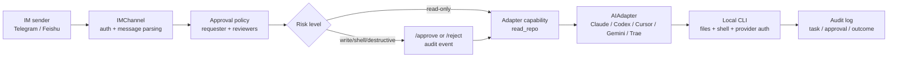

# AI Company OS

> **Manage your local AI coding agents like a remote team — from Telegram, while you sleep.**

[](LICENSE)
[](https://www.python.org/downloads/)
[](https://github.com/MarcelLeon/ai-company-os/actions/workflows/ci.yml)
[](https://github.com/astral-sh/ruff)
[](https://mypy.readthedocs.io/)
[](CONTRIBUTING.md)

[中文](README.zh-CN.md) · [Quickstart](docs/human/quickstart.md) · [Demo](docs/examples/release-room.md) · [Roadmap](STATUS.md) · [Architecture](docs/architecture/boss-first-grounding.md) · [Agents](AGENTS.md)


AICO turns the AI tools already on your laptop — Claude Code, Codex, Cursor, Gemini,
Trae, CodeFlicker, or your own CLI — into a remote project team you can manage from
Telegram today. Feishu is implemented as the first non-Telegram channel slice and is
still awaiting production smoke. Roles, project memory, approval gates, audit trails,
task status, and a morning handoff — all over IM, without sitting at the laptop.

> **Try it in 30 seconds, no tokens needed:**
> ```bash
> git clone https://github.com/MarcelLeon/ai-company-os.git && cd ai-company-os
> env UV_CACHE_DIR=/tmp/aico-uv-cache uv run --python 3.11 aico-release-room-demo
> ```
> Runs the full Release Room flow with deterministic fake adapters — no Telegram bot,
> no Claude account, no spend.

## The Problem

Your AI coding agents are powerful — but they're chained to the desk in front of them.
Long tasks die when the laptop sleeps. Multi-agent work degenerates into parallel chat
windows. Risky writes have no real approval boundary. Context, decisions, and blockers
don't survive across agents or restarts.

AICO is built on one bet: agent developers don't need smarter agents — they need a thin
operating layer that makes the agents they already have manageable like a real team,
remotely, while they're not at the desk.

## How It Compares

|  | Cursor / Aider / Continue | SWE-agent / OpenDevin | Multi-agent frameworks (CrewAI / AutoGen) | **AI Company OS** |
|---|:---:|:---:|:---:|:---:|
| Control local agents while you're away from the laptop | ❌ | ❌ | partial | ✅ |
| IM-native control (Telegram; Feishu first slice) | ❌ | ❌ | ❌ | ✅ |
| Multi-CLI orchestration (Claude + Codex + Cursor + …) | ❌ | ❌ | rebuild yourself | ✅ |
| Approval gate before file/shell writes | ❌ | ❌ | ❌ | ✅ |
| Audit log + restart-aware state | ❌ | partial | ❌ | ✅ |
| Project memory shared across agents | partial | ❌ | partial | ✅ |
| Overnight task handoff + morning report | ❌ | ❌ | ❌ | ✅ |

The wedge is intentional: AICO is for developers who want to operate a local AI **team**
remotely, not a smarter chat UI for one agent.

## What It Does

- **IM-first command center**: manage agents from Telegram today, with Feishu as the first
  non-Telegram channel slice.
- **Real local adapters**: route work to Claude Code, Codex, Cursor, CodeFlicker, Trae,
  Gemini, and future local or company CLIs through one adapter contract.
- **Project office semantics**: model projects, roles, appointments, leads, team views,
  daily reports, risks, blockers, and next actions.
- **Approval and audit**: file writes, shell execution, and destructive actions go through
  remote approval and leave traceable audit events.
- **Shared memory**: keep project-scoped and boss preference memory in append-only JSONL,
  with controlled prompt injection.
- **Observable work**: inspect tasks, child tasks, metrics, audit history, and compact
  local glance output.
- **Offline delegation**: use `/overnight` to leave work with a project lead, then review
  `/inbox`, `/morning`, `/task`, and `/audit` later.

## Use It Today

Three concrete workflows are ready to try:

- **Maintain an open-source repo like a release room**: appoint PM, implementer, tester,
  reviewer, and release manager roles; then use `/ask`, `/inbox`, `/morning`, and `/audit`
  to drive a small release without losing the project thread.
- **Leave a bugfix overnight**: use `/overnight` to hand a scoped bugfix plan to the
  current project lead, keep risky writes behind `/approve`, and review `/morning` and
  `/task` the next morning.
- **Approve a release from your commute**: when an agent needs file writes or shell
  execution, approve or reject from Telegram, then inspect `/task` and `/audit` without
  opening the laptop.

## Demo: Release Room

The main demo is a small open-source release workflow:

1. Open a project room from Telegram.
2. Appoint PM, tester, reviewer, implementer, and release manager roles.
3. Write project memory that later tasks inherit.
4. Ask agents to plan, test, review, and report.
5. Approve risky work, interrupt stuck work, and inspect audit history.
6. Leave remaining work overnight and review the morning handoff.

See [docs/examples/release-room.md](docs/examples/release-room.md) and
[examples/release-room/transcript.md](examples/release-room/transcript.md).

## What Works Today

Current status is tracked in [STATUS.md](STATUS.md). As of the current public pass:

- Telegram control path: working and dogfooded.
- Claude Code and Codex adapters: working for real local CLI tasks.
- Cursor, CodeFlicker, Trae, and Gemini adapters: implemented behind opt-in flags, with
  real smoke tests completed.
- Feishu channel: text send/edit/delete, URL verification, event parsing, webhook
  runtime, and local idempotency are implemented; production smoke test is still pending.
- Project office commands: `/project`, `/team`, `/roles`, `/appoint`, `/lead`,
  `/ask`, `/brief`, `/risks`, `/blockers`, `/next`, `/daily`, `/weekly`.
- Safety and operations: `/approve`, `/reject`, `/interrupt`, `/tasks`, `/task`,
  `/metrics`, `/audit`.
- Shared memory: `/remember`, `/recall`, `/forget`, JSONL persistence, and controlled
  project prompt injection.
- Offline delegation: `/overnight` work orders persist across restart when
  `AICO_STATE_DB_PATH` is configured.
- aico-view: `/view` can send a self-contained read-only HTML snapshot through IM when
  `AICO_VIEW_ENABLED=true`.
- Local state tooling: `aico-state --db <path>` prints SQLite schema version and
  table counts; `reset --yes` clears known AICO state tables for fast iteration.

## Security Model

AICO is a control layer in front of local tools, not a sandbox. Risky actions should pass
through approval and audit before they reach a local CLI.



See [SECURITY.md](SECURITY.md) before exposing AICO to untrusted chats, public callbacks,
or high-privilege local environments.

## Quickstart

The 30-second no-token demo at the top of this README is the fastest way to see the
product shape. To wire AICO to your real Telegram bot and a local AI CLI:

Requirements:

- macOS or Linux
- Python 3.11+
- `uv`
- Telegram bot token
- At least one local agent CLI, for example Claude Code or Codex

```bash
git clone https://github.com/MarcelLeon/ai-company-os.git
cd ai-company-os

export AICO_TELEGRAM_BOT_TOKEN="your Telegram bot token"
export AICO_CLAUDE_WORKING_DIRECTORY="$PWD"
export AICO_ENABLE_CODEX_ADAPTER=true
export AICO_PERSONA_CONFIG_PATH="config/personas.example.json"
export AICO_PROJECT_CONFIG_PATH="config/projects.example.json"
export AICO_AUDIT_LOG_PATH="/tmp/aico-audit.jsonl"
export AICO_MEMORY_PATH="/tmp/aico-memory.jsonl"
export AICO_STATE_DB_PATH="/tmp/aico-state.db"

env UV_CACHE_DIR=/tmp/aico-uv-cache uv sync --python 3.11
env UV_CACHE_DIR=/tmp/aico-uv-cache uv run --python 3.11 aico-phase1
```

Then message your Telegram bot:

```text
/help
/status
/project aico
/team
/ask pm summarize the next release plan in 3 bullets
/inbox
/morning
/tasks
/audit
```

See the full [Quickstart](docs/human/quickstart.md) for adapter flags and common
commands.

## Architecture

AICO keeps volatile tool details behind stable interfaces:

- `AIAdapter`: local or remote AI tool integration.
- `IMChannel`: Telegram, Feishu, and future message channels.
- `TaskBus`: task lifecycle, streaming output, interruption, and status.
- `ProjectAssignmentDirectory`: projects, roles, agents, appointments, and lead role.
- `MemoryStore`: append-only project memory and evidence.
- `AuditLog`: traceable events for approval, collaboration, task state, and metrics.

Design notes live in [docs/architecture](docs/architecture), and accepted decisions live
in [docs/decisions](docs/decisions).

## For Agent Developers (Build Your Own Adapter)

Cursor, Aider, OpenClaw, an internal company CLI — if your agent is a process that
takes a prompt and streams output, AICO can drive it as a team member alongside Claude
Code and Codex. Implement one Protocol and register it; never edit the core.

See [docs/agent/adapter-authoring.md](docs/agent/adapter-authoring.md) for the full
contract. The fastest existing implementations to read:

- [src/aico/adapter/base.py](src/aico/adapter/base.py) — the `AIAdapter` Protocol
- [src/aico/adapter/cursor.py](src/aico/adapter/cursor.py) — minimal real adapter
- [src/aico/adapter/claude_code.py](src/aico/adapter/claude_code.py) — full session-resume adapter
- [src/aico/core/orchestrator.py](src/aico/core/orchestrator.py) — how adapters are dispatched
- [src/aico/core/memory.py](src/aico/core/memory.py) — A2A memory fabric

## For Personal Developers

AICO is useful if your real problem sounds like this:

- "I want Claude Code or Codex to keep working while I am away."
- "I want to approve writes from my phone."
- "I want separate PM, tester, reviewer, and implementer roles over the same repo."
- "I want a morning summary instead of scrolling terminal history."
- "I want a repeatable way to run my own open-source project like a tiny company."

If you only need a single agent in the terminal while sitting at the laptop, AICO is
probably too much.

## Star History

[](https://star-history.com/#MarcelLeon/ai-company-os&Date)

## Roadmap

Near-term work:

- Real-IM dogfood of `/view` IM-delivered HTML snapshot and operator inbox flow.
- Split the orchestrator after Phase 8 wraps (B-005).
- Finish Feishu production callback smoke testing.
- Multi-step / multi-agent overnight orchestration on top of the absence loop.
- Pluggable semantic backend behind the memory retriever.

See [STATUS.md](STATUS.md) for the live roadmap.

## GitHub Publication Checklist

Repository description, topics, and social preview are GitHub repository metadata, so
they must be configured in the GitHub UI by a repository admin. Use
[docs/human/github-publication.md](docs/human/github-publication.md) for the exact text,
topic list, image guidance, and click path.

AI agents preparing a public release should also follow
[docs/agent/09-github-release-ops.md](docs/agent/09-github-release-ops.md) before
tagging or creating a GitHub Release.

## Contributing

New contributors: 30 minutes to first PR via
[docs/contributors/quickstart.md](docs/contributors/quickstart.md). It runs entirely
against the no-token Release Room demo, so you don't need a Telegram bot or any LLM
provider.

Humans should also read [CONTRIBUTING.md](CONTRIBUTING.md) before opening a PR.

AI agents must start with [AGENTS.md](AGENTS.md). This repository is intentionally
structured so another agent can continue from previous rounds without guessing.

We follow the [Contributor Covenant Code of Conduct](CODE_OF_CONDUCT.md). Be kind.

For vulnerabilities or approval bypasses, read [SECURITY.md](SECURITY.md) before opening
a public issue.

## License

MIT. See [LICENSE](LICENSE).
