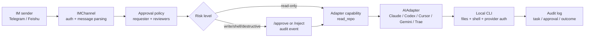

# AI Company OS

> Remote control room for your local AI coding agents.

[中文说明](README.zh-CN.md) · [Quickstart](docs/human/quickstart.md) · [Release Room demo](docs/examples/release-room.md) · [Roadmap](STATUS.md) · [Boss-first roadmap](docs/architecture/boss-first-grounding.md) · [Agent handoff](AGENTS.md)

AI Company OS turns the AI tools already running on your machine, such as Claude Code,
Codex, Cursor, Gemini, Trae, CodeFlicker, OpenClaw, or internal CLIs, into a remote
project team you can manage from Telegram or Feishu.

It is not another chat UI. It is an orchestration layer for developers who want to leave
the desk while their local agents keep working with roles, project memory, approval
gates, audit trails, task status, and morning handoff.


## The Pain

Modern AI coding work is powerful, but still awkward in daily use:

- Your agents are scattered across many CLIs and IDE tools.
- Long tasks are tied to the laptop in front of you.
- Dangerous actions still need a real approval boundary.
- Multi-agent work often becomes parallel chat, not a managed delivery process.
- Context, decisions, blockers, and status are hard to carry across agents.

AICO starts from a simple product bet: agent developers do not only need smarter agents.
They need a small operating layer that makes local agents manageable like a real team.

## What It Does

- **IM-first command center**: manage agents from Telegram today, with Feishu as the first
  non-Telegram channel slice.
- **Real local adapters**: route work to Claude Code, Codex, Cursor, CodeFlicker, Trae,
  Gemini, and future local or company CLIs through one adapter contract.
- **Project office semantics**: model projects, roles, appointments, leads, team views,
  daily reports, risks, blockers, and next actions.
- **Approval and audit**: file writes, shell execution, and destructive actions go through
  remote approval and leave traceable audit events.
- **Shared memory**: keep project-scoped and boss preference memory in append-only JSONL,
  with controlled prompt injection.
- **Observable work**: inspect tasks, child tasks, metrics, audit history, and compact
  local glance output.
- **Offline delegation**: use `/overnight` to leave work with a project lead, then review
  `/daily`, `/tasks`, and `/audit` later.

## Use It Today

Three concrete workflows are ready to try:

- **Maintain an open-source repo like a release room**: appoint PM, implementer, tester,
  reviewer, and release manager roles; then use `/ask`, `/tasks`, `/daily`, and `/audit`
  to drive a small release without losing the project thread.
- **Leave a bugfix overnight**: use `/overnight` to hand a scoped bugfix plan to the
  current project lead, keep risky writes behind `/approve`, and review `/daily` the
  next morning.
- **Approve a release from your commute**: when an agent needs file writes or shell
  execution, approve or reject from Telegram, then inspect `/task` and `/audit` without
  opening the laptop.

## Why It Is Different

| Common approach | AICO approach |
|---|---|
| A web or desktop agent workspace | IM-first remote control for the agents already on your machine |
| A single agent wrapper | Multi-adapter project team with roles and appointments |
| Autonomous shell access by default | Approval, audit, interruption, and capability gates |
| A memory feature the user must maintain | Agent-driven memory with correction commands |
| Demo-only workflows | Dogfooded Release Room flow using real Telegram and local CLIs |

The narrow wedge is intentional: AICO is for developers who want to operate a local AI
team remotely, not for replacing every IDE, chat app, or workflow engine.

## Demo: Release Room

The main demo is a small open-source release workflow:

1. Open a project room from Telegram.
2. Appoint PM, tester, reviewer, implementer, and release manager roles.
3. Write project memory that later tasks inherit.
4. Ask agents to plan, test, review, and report.
5. Approve risky work, interrupt stuck work, and inspect audit history.
6. Leave remaining work overnight and review the morning handoff.

See [docs/examples/release-room.md](docs/examples/release-room.md) and
[examples/release-room/transcript.md](examples/release-room/transcript.md).

## What Works Today

Current status is tracked in [STATUS.md](STATUS.md). As of the current public pass:

- Telegram control path: working and dogfooded.
- Claude Code and Codex adapters: working for real local CLI tasks.
- Cursor, CodeFlicker, Trae, and Gemini adapters: implemented behind opt-in flags, with
  real smoke tests completed.
- Feishu channel: text send/edit/delete, URL verification, event parsing, webhook
  runtime, and local idempotency are implemented; production smoke test is still pending.
- Project office commands: `/project`, `/team`, `/roles`, `/appoint`, `/lead`,
  `/ask`, `/brief`, `/risks`, `/blockers`, `/next`, `/daily`, `/weekly`.
- Safety and operations: `/approve`, `/reject`, `/interrupt`, `/tasks`, `/task`,
  `/metrics`, `/audit`.
- Shared memory: `/remember`, `/recall`, `/forget`, JSONL persistence, and controlled
  project prompt injection.
- Offline delegation: `/overnight` work orders persist across restart when
  `AICO_STATE_DB_PATH` is configured.
- Local state tooling: `aico-state --db <path>` prints SQLite schema version and
  table counts; `reset --yes` clears known AICO state tables for fast iteration.

## Security Model

AICO is a control layer in front of local tools, not a sandbox. Risky actions should pass
through approval and audit before they reach a local CLI.



See [SECURITY.md](SECURITY.md) before exposing AICO to untrusted chats, public callbacks,
or high-privilege local environments.

## Quickstart

Want to see the product shape before creating a bot token?

```bash
env UV_CACHE_DIR=/tmp/aico-uv-cache uv run --python 3.11 aico-release-room-demo
```

This runs the Release Room flow with deterministic fake adapters, so it does not call
Telegram, Claude, Codex, or any paid provider.

Requirements:

- macOS or Linux
- Python 3.11+
- `uv`
- Telegram bot token
- At least one local agent CLI, for example Claude Code or Codex

```bash
git clone https://github.com/MarcelLeon/ai-company-os.git
cd ai-company-os

export AICO_TELEGRAM_BOT_TOKEN="your Telegram bot token"
export AICO_CLAUDE_WORKING_DIRECTORY="$PWD"
export AICO_ENABLE_CODEX_ADAPTER=true
export AICO_PERSONA_CONFIG_PATH="config/personas.example.json"
export AICO_PROJECT_CONFIG_PATH="config/projects.example.json"
export AICO_AUDIT_LOG_PATH="/tmp/aico-audit.jsonl"
export AICO_MEMORY_PATH="/tmp/aico-memory.jsonl"
export AICO_STATE_DB_PATH="/tmp/aico-state.db"

env UV_CACHE_DIR=/tmp/aico-uv-cache uv sync --python 3.11
env UV_CACHE_DIR=/tmp/aico-uv-cache uv run --python 3.11 aico-phase1
```

Then message your Telegram bot:

```text
/help
/status
/project aico
/team
/ask pm summarize the next release plan in 3 bullets
/tasks
/audit
```

See the full [Quickstart](docs/human/quickstart.md) for adapter flags and common
commands.

## Architecture

AICO keeps volatile tool details behind stable interfaces:

- `AIAdapter`: local or remote AI tool integration.
- `IMChannel`: Telegram, Feishu, and future message channels.
- `TaskBus`: task lifecycle, streaming output, interruption, and status.
- `ProjectAssignmentDirectory`: projects, roles, agents, appointments, and lead role.
- `MemoryStore`: append-only project memory and evidence.
- `AuditLog`: traceable events for approval, collaboration, task state, and metrics.

Design notes live in [docs/architecture](docs/architecture), and accepted decisions live
in [docs/decisions](docs/decisions).

## For Agent Developers

If you are building agents, adapters, or internal AI CLIs, the interesting part is not
the Telegram bot itself. It is the operating contract around agents:

- capability declarations and risk gates
- project-scoped prompt stack
- role handoff and appointment model
- shared memory governance
- restart-aware audit and metrics direction
- IM-native approval and interruption

The fastest code paths to inspect are:

- [src/aico/adapter/base.py](src/aico/adapter/base.py)
- [src/aico/channel/base.py](src/aico/channel/base.py)
- [src/aico/core/orchestrator.py](src/aico/core/orchestrator.py)
- [src/aico/core/project_assignment.py](src/aico/core/project_assignment.py)
- [src/aico/core/memory.py](src/aico/core/memory.py)
- [src/aico/core/audit.py](src/aico/core/audit.py)

## For Personal Developers

AICO is useful if your real problem sounds like this:

- "I want Claude Code or Codex to keep working while I am away."
- "I want to approve writes from my phone."
- "I want separate PM, tester, reviewer, and implementer roles over the same repo."
- "I want a morning summary instead of scrolling terminal history."
- "I want a repeatable way to run my own open-source project like a tiny company."

If you only need a single agent in the terminal while sitting at the laptop, AICO is
probably too much.

## Roadmap

Near-term work:

- Polish the public Release Room GIF and first-run story.
- Add an operator inbox for offline delegation handoff and pending human actions.
- Finish Feishu production callback smoke testing.
- Add cleaner public setup docs and starter issues for external contributors.
- Add adapter authoring docs and a no-token local demo path.

See [STATUS.md](STATUS.md) for the live roadmap.

## GitHub Publication Checklist

Repository description, topics, and social preview are GitHub repository metadata, so
they must be configured in the GitHub UI by a repository admin. Use
[docs/human/github-publication.md](docs/human/github-publication.md) for the exact text,
topic list, image guidance, and click path.

## Contributing

Humans should start with [CONTRIBUTING.md](CONTRIBUTING.md).

AI agents must start with [AGENTS.md](AGENTS.md). This repository is intentionally
structured so another agent can continue from previous rounds without guessing.

For vulnerabilities or approval bypasses, read [SECURITY.md](SECURITY.md) before opening
a public issue.

## License

MIT. See [LICENSE](LICENSE).
