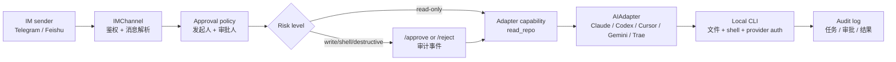

# AI Company OS

> 面向本机 AI coding agents 的远程项目作战室。

[English](README.md) · [快速上手](docs/human/quickstart.md) · [Release Room Demo](docs/examples/release-room.md) · [路线图](STATUS.md) · [老板第一路线图](docs/architecture/boss-first-grounding.md) · [Agent 接手入口](AGENTS.md)

AI Company OS 把你电脑上的 Claude Code、Codex、Cursor、Gemini、Trae、CodeFlicker、
或你自己的 CLI 收编成一个可以通过 Telegram 远程管理的项目团队。飞书已经实现第一个非
Telegram Channel 切片,但仍待生产 smoke test 后再作为稳定入口推荐;OpenClaw 或公司内部
AI CLI 可以按同一 Adapter 协议后续接入。

它不是另一个聊天 UI。它更像一个小型运营层:当你离开电脑时,仍能用 IM 派工、审批、
打断、看日报、查审计,让本机 agent 以项目、岗位、记忆和交付状态的方式继续工作。


## 解决什么痛点

今天的 AI coding 工具很强,但日常使用里还有几个很实际的问题:

- AI 工具散在多个 CLI 和 IDE 里,各管各的。
- 长任务仍然绑定在电脑前,人离开后不可控。
- 写文件、跑 shell、破坏性动作需要一个真正的远程审批边界。
- 多 agent 协作经常只是并行聊天,不像真实交付流程。
- 项目上下文、决策、卡点和状态很难在 agent 之间持续传递。

AICO 的产品判断是:agent 开发者不只需要更聪明的 agent,还需要一个很小但可靠的
操作层,把本机 agents 管理得像一个真实团队。

## 它能做什么

- **IM 主控台**:当前以 Telegram 为主控入口;飞书作为第一个非 Telegram Channel
  切片,仍待生产 smoke test。
- **真实本机 Adapter**:通过统一适配器协议接入 Claude Code、Codex、Cursor、
  CodeFlicker、Trae、Gemini,后续也能接公司内部 CLI。
- **项目办公室语义**:支持项目、岗位、任命、负责人、团队视图、日报、风险、卡点和下一步。
- **审批与审计**:写文件、shell 执行和破坏性动作先走远程审批,并留下审计事件。
- **共享记忆**:用 append-only JSONL 保存项目记忆和老板偏好,受控注入 prompt。
- **可观测工作流**:可以查看任务、子任务、指标、审计历史和本地 glance 输出。
- **离线托管**:用 `/overnight` 睡前下任务,之后通过 `/inbox`、`/morning`、`/task`、
  `/audit` 接手和追溯交付情况。

## 今天能拿它做什么

可以先试这 3 个具体场景:

- **像 release room 一样维护开源项目**:任命 PM、implementer、tester、reviewer、
  release manager,再用 `/ask`、`/inbox`、`/morning`、`/audit` 推进一个小版本发布。
- **睡前托管一个 bugfix**:用 `/overnight` 把范围清楚的 bugfix 交给当前项目 lead,
  写文件和 shell 仍走 `/approve`,第二天看 `/morning` 和 `/task` 验收。
- **通勤路上审批 release**:agent 需要写文件或执行命令时,在 Telegram 里批准或拒绝,
  再用 `/task` 和 `/audit` 看结果,不用打开电脑。

## 和常见方案有什么不同

| 常见方案 | AICO 的选择 |
|---|---|
| Web / 桌面 agent 工作台 | IM-first,远程指挥本机已有 AI 工具 |
| 单 agent wrapper | 多 Adapter + 项目岗位 + 任命关系 |
| 默认让 agent 自主跑 shell | 审批、审计、打断、能力门禁 |
| 要用户手动维护记忆 | agent 主动维护记忆,命令作为纠错入口 |
| 只做 demo 工作流 | Release Room 已用真实 Telegram 和本机 CLI dogfooding |

这个边界是刻意收窄的:AICO 不想替代 IDE、聊天软件或所有 workflow engine。它先解决
“我不在电脑前,但仍要管理本机 AI 团队干活”这个窄而强的场景。

## Demo: Release Room

主 Demo 是一个小型开源发布流程:

1. 在 Telegram 中进入项目作战室。
2. 任命 PM、tester、reviewer、implementer、release manager。
3. 写入项目记忆,后续角色任务自动继承。
4. 让 agent 规划、测试、review、汇报。
5. 对风险动作审批,对卡住任务打断,查看审计轨迹。
6. 把剩余工作托管到夜间,第二天看早报。

详见 [docs/examples/release-room.md](docs/examples/release-room.md) 和
[examples/release-room/transcript.md](examples/release-room/transcript.md)。

## 当前已经能用什么

实时状态见 [STATUS.md](STATUS.md)。当前公开入口改造时:

- Telegram 主控链路:已跑通并 dogfooding。
- Claude Code / Codex Adapter:已可执行真实本机 CLI 任务。
- Cursor / CodeFlicker / Trae / Gemini Adapter:已实现可选开关,真实 smoke test 已完成。
- Feishu Channel:已实现文本发送、编辑、删除、URL verification、事件解析、webhook runtime
  和本地幂等;真实生产 smoke test 待完成。
- 项目办公室命令:`/project`、`/team`、`/roles`、`/appoint`、`/lead`、`/ask`、
  `/brief`、`/risks`、`/blockers`、`/next`、`/daily`、`/weekly`。
- 安全与运维命令:`/approve`、`/reject`、`/interrupt`、`/tasks`、`/task`、
  `/metrics`、`/audit`。
- 共享记忆:`/remember`、`/recall`、`/forget`、JSONL 持久化和受控项目 prompt 注入。
- 离线托管:配置 `AICO_STATE_DB_PATH` 后,`/overnight` 工单可跨重启恢复。
- aico-view:配置 `AICO_VIEW_ENABLED=true` 后,`/view` 可通过 IM 发送自包含只读 HTML 快照。
- 本地状态工具:`aico-state --db <path>` 可查看 SQLite schema version 和表行数,
  `reset --yes` 可清空已知 AICO 状态表,方便快速迭代。

## 安全模型

AICO 是本机工具前面的控制层,不是独立沙箱。风险动作应该先经过审批和审计,再触达本机
CLI。



把 AICO 暴露给不可信聊天、公开 callback 或高权限本机环境前,请先读
[SECURITY.md](SECURITY.md)。

## 快速上手

如果你想先看产品形态,不想立刻创建 Telegram Bot Token,可以先跑无 token demo:

```bash
env UV_CACHE_DIR=/tmp/aico-uv-cache uv run --python 3.11 aico-release-room-demo
```

它会用 deterministic fake adapters 跑 Release Room 链路,不会调用 Telegram、Claude、
Codex 或任何付费 provider。

前置依赖:

- macOS 或 Linux
- Python 3.11+
- `uv`
- Telegram Bot Token
- 至少一个本机 agent CLI,例如 Claude Code 或 Codex

```bash
git clone https://github.com/MarcelLeon/ai-company-os.git
cd ai-company-os

export AICO_TELEGRAM_BOT_TOKEN="你的 Telegram Bot Token"
export AICO_CLAUDE_WORKING_DIRECTORY="$PWD"
export AICO_ENABLE_CODEX_ADAPTER=true
export AICO_PERSONA_CONFIG_PATH="config/personas.example.json"
export AICO_PROJECT_CONFIG_PATH="config/projects.example.json"
export AICO_AUDIT_LOG_PATH="/tmp/aico-audit.jsonl"
export AICO_MEMORY_PATH="/tmp/aico-memory.jsonl"
export AICO_STATE_DB_PATH="/tmp/aico-state.db"

env UV_CACHE_DIR=/tmp/aico-uv-cache uv sync --python 3.11
env UV_CACHE_DIR=/tmp/aico-uv-cache uv run --python 3.11 aico-phase1
```

`aico-phase1` 是长驻 Telegram runtime。使用 bot 时保持它运行;停止时按 `Ctrl-C`。

然后在 Telegram Bot 中发送:

```text
/help
/status
/project aico
/team
/ask pm summarize the next release plan in 3 bullets
/inbox
/morning
/tasks
/audit
```

更多配置和常用命令见 [快速上手](docs/human/quickstart.md)。

## 给 AI Agent 开发者

如果你在做 agent、adapter 或内部 AI CLI,这里最有价值的不是 Telegram bot 本身,而是围绕
agent 的操作契约:

- 能力声明和风险门禁
- project-scoped prompt stack
- role handoff 和 appointment model
- shared memory governance
- audit / metrics 的重启恢复方向
- IM-native approval 和 interruption

最快可以从这些文件看起:

- [src/aico/adapter/base.py](src/aico/adapter/base.py)
- [src/aico/channel/base.py](src/aico/channel/base.py)
- [src/aico/core/orchestrator.py](src/aico/core/orchestrator.py)
- [src/aico/core/project_assignment.py](src/aico/core/project_assignment.py)
- [src/aico/core/memory.py](src/aico/core/memory.py)
- [src/aico/core/audit.py](src/aico/core/audit.py)

## 给个人开发者

如果你的真实问题是下面这些,AICO 会有用:

- “我想让 Claude Code / Codex 在我离开电脑时继续工作。”
- “我想在手机上审批写文件。”
- “我想让 PM、tester、reviewer、implementer 围绕同一个 repo 分工。”
- “我想早上看一份工作简报,而不是翻终端历史。”
- “我想像经营一个小公司一样迭代自己的开源项目。”

如果你只需要坐在电脑前用一个 agent 跑一次任务,AICO 可能有点重。

## 路线图

近期重点:

- 真实 IM dogfood `/view` HTML 快照和 operator inbox 交接体验。
- 根据 dogfood 结果产品化 aico-view Boss Brief 第一屏。
- 完成飞书生产 callback smoke test。
- 拆分 Orchestrator 结构债(B-005)。
- 在 absence loop 上继续做多 step / 多 agent 夜间编排。

实时路线图见 [STATUS.md](STATUS.md)。

## 贡献

人类开发者请先读 [CONTRIBUTING.md](CONTRIBUTING.md)。

AI/LLM/Agent 请从 [AGENTS.md](AGENTS.md) 开始。这个仓库刻意维护了 Agent 接手协议,
避免下一轮 agent 重新猜前人已经想过什么。

如果发现安全漏洞、审批绕过或 token 泄露风险,请先读 [SECURITY.md](SECURITY.md),
不要直接开公开 issue 暴露细节。

## 许可证

MIT。见 [LICENSE](LICENSE)。
