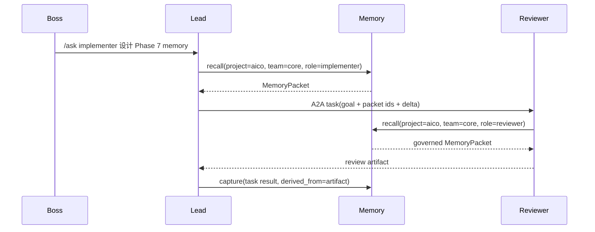

# A2A Memory Fabric — AICO 共享记忆架构

> 本文是 Phase 7 共享记忆层的架构说明。ADR-0022 记录决策,本文记录实现时应遵守的结构和数据流。

---

## 一句话定位

**A2A Memory Fabric 是 AICO 的项目 / 团队级记忆基础设施:agent 通过它沉淀、召回、广播和治理记忆,
老板通过项目管理命令受益,而不是手动维护记忆库。**

它借鉴 Attack on Memory 的四个方向:

- Graph Retrieval:记忆之间有支持、冲突、继承、广播关系。
- Time-window Retrieval:短期工作记忆和长期项目记忆分开召回。
- Governance:按 project / team / role / sensitivity 做选择性披露。
- BranchWorldModel:设计分支、假设和被否决方案可以作为分支记忆管理。

---

## A2A 兼容边界

AICO 当前仍以内置 TaskBus 为主,暂不直接暴露完整 HTTP A2A server。
但 Memory Fabric 的领域对象要能映射到 A2A:

| AICO | A2A | 约束 |
|---|---|---|
| `Task` | Task | A2A 协作任务仍走 TaskBus,不绕过审批和审计 |
| `MessageContent` | Message / Part | IM 和 agent 间消息只承载必要 delta |
| `MemoryPacket` | DataPart | 召回包是结构化上下文,不是原始 store dump |
| `MemoryArtifact` | Artifact | 写入、广播、共识结果作为任务产物 |
| `project/team conversation` | Context | context 绑定 project + team + task/thread |
| `MemoryBroadcastEvent` | push / extension | 内部先走 audit/event bus,未来映射 A2A push |

核心原则:agent 不访问彼此内部记忆,只接收 MemoryGovernor 投影后的 `MemoryPacket`。

---

## 领域对象

### MemoryAtom

最小可验证记忆单元:

```text
memory_id
claim
evidence[]
scope
confidence
source
created_by
created_at
ttl
sensitivity
status: active / candidate / archived / superseded
purpose_tags: general_context / public_broadcast / task_key_progress / task_private / decision_review
reason
```

### MemoryEvidence

证据引用,可以指向:

- boss 消息。
- A2A task id。
- agent output artifact。
- audit event。
- repo 文件或文档路径。

证据只存引用和摘要,不强制复制完整原文。

### MemoryScope

必须显式写作用域:

| 层级 | 例子 | 默认共享边界 |
|---|---|---|
| boss | `boss:wang` | boss 全局偏好,可注入任意 project,但只限偏好/工作方式 |
| project | `project:aico` | 同 project 可见 |
| team | `team:aico/core` | 同 project + team 可见 |
| role | `role:aico/core/reviewer` | role + lead 可见 |
| agent | `agent:aico/core/codex` | 默认只给该 agent 和 lead |

禁止默认跨 project / 跨 team 共享。需要跨域时必须形成新的记忆写入,不能复用原 atom 的可见性。

### MemoryEdge

第一版支持:

- `supports`:支持某条记忆。
- `contradicts`:与某条记忆冲突。
- `derived_from`:从任务、消息或记忆派生。
- `broadcast_to`:某条记忆已广播给某 team。
- `supersedes`:替代旧记忆。

### MemoryPacket

Prompt Stack 注入的只读投影:

```text
packet_id
scope
items[]
citations[]
generated_at
policy_summary
```

每个 item 只包含 claim、confidence、reason、citation id,不包含完整内部 metadata。
`purpose_tags` 会随 item 投影,用于说明这条记忆是公共共识、任务关键进展、
内部短期记忆还是决策评审。

---

## 主要服务

### MemoryStore

权威存储接口:

- `append_atom(atom)`
- `append_edge(edge)`
- `list_atoms(scope, include_archived=False)`
- `search(query)`
- `archive(memory_id, reason)`

第一版实现为 `JsonlMemoryStore`。图关系也写 JSONL,先用内存索引重建。

### MemoryRetriever

负责召回:

- scope filter:boss + project + team + role。
- time-window filter:短期任务记忆与长期项目记忆分开。
- graph expansion:沿 supports / derived_from / broadcast_to 扩展少量邻居。
- ranking:confidence + recency + scope closeness + semantic score。第一版 semantic score 由可插拔 `MemorySemanticScorer` 提供,默认本地实现;后续可替换为 embedding / LLM rerank。

### MemoryGovernor

负责选择性披露:

- project/team 隔离。
- role scope 过滤。
- sensitivity 过滤。
- confidence 下限。
- archived / superseded 过滤。
- purpose 过滤:普通检索默认排除 `task_private`;lead 决策优先读取 `public_broadcast`、
  `task_key_progress` 和 `decision_review`。

### MemoryCaptureService

负责把对话、任务结果和 agent 反馈变成候选 atom。

输入:
- boss message。
- A2A task result。
- lead agent summary。
- report facts。

输出:
- active atom。
- candidate atom。
- rejected extraction event。

### MemoryBroadcastService

负责共识广播:

- 接收 `MemoryIntent(broadcast | consensus_request)`。
- 检查 scope、confidence、sensitivity、冲突。
- 写入 `broadcast_to` edge。
- 为 team 下 appointment 生成 receipt。
- 后续 prompt stack 自动注入该 team memory。

---

## 四个关键场景

### 1. Agent 间协作有记忆



约束:
- A2A 发起任务必须带 project 或 team scope。
- 跨 project / team 不共享原始 memory packet。
- 子任务产物可派生新 team/project memory。

### 2. Boss 会话抽取偏好 / feedback

```text
boss: “以后别让我手动维护记忆,这个会很痛苦”
```

抽取候选:

```text
claim: Boss prefers memory to be maintained by agents, not manually operated by the boss.
scope: boss:wang OR project:aico
confidence: 0.87
reason: explicit feedback about product direction; may be global product preference and current project constraint.
```

如果 LLM 判断 scope 不确定:

- 写 `candidate`。
- lead agent 在日报或下一次交接中提示老板确认。

### 3. Team 共识广播

```text
/meeting remember Phase 7 memory must be agent-driven, with slash commands only as control surfaces.
```

底层流程:

1. 生成 `MemoryIntent(broadcast)`。
2. 写入 team memory。
3. 对 team 下 appointment 生成 receipt。
4. 后续每个 agent 的 prompt stack 会看到该共识。

agent 自发广播也走同一流程,只是 source 从 boss message 变成 agent artifact。

### 4. 用记忆广播减少 A2A 消息

传统方式:

```text
Lead -> Reviewer: 大段背景 + 任务 + 约束 + 已否决方案 + boss 偏好...
```

Memory Fabric 方式:

```text
Lead -> Reviewer:
goal: review this memory design
memory_refs: [mem_aico_..., mem_team_...]
delta: focus on scope isolation and broadcast policy
```

Reviewer 根据 refs 召回受控 packet。这样长背景只存一次,多 agent 复用。

---

## 命令与产品入口

保留:

```text
/remember <text>
/recall [query]
/forget <memory_id>
```

新增候选入口:

```text
/meeting remember <text>
/memory broadcast <memory_id>
/memory inbox
```

这些不是老板主路径。主路径仍是:

```text
/project
/team
/ask
/brief
/daily
/weekly
```

---

## 第一版验收重点

- boss 发项目命令时,lead agent 自动召回 project/team/boss 记忆。
- agent 发起 A2A 子任务时,子任务带 project/team scope。
- task 完成后能抽取候选 memory atom。
- boss feedback 能被识别为 boss global 或 project memory。
- team broadcast 能让同 team agent 后续自动看到共识。
- `/recall` 能显示来源、confidence、scope、broadcast receipts。
- `/forget` 归档后不再注入 prompt stack。

---

## 暂不做

- 不做全局跨项目团队脑。
- 不引入向量库 / 图数据库。
- 不暴露完整内部 memory store 给任意 agent。
- 不让广播绕过审批、审计和 sensitivity policy。
- 不默认用 memory refs 替代所有消息;先作为 token-saving 实验。
