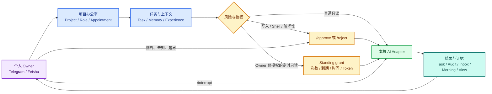

# AICO 核心能力地图

> 给隔了一段时间重新回来的人：15 分钟重新理解 AICO，不需要先读 200 多轮研发记录。

## 一句话

AICO 是面向个人开发者的、本机优先的 Human-on-the-loop 控制层：你从 IM 给自己电脑上的
Claude Code、Codex 等 Agent 下任务；Agent 在已知边界内推进，风险和例外回到你这里，
所有过程留下可接手的任务状态、审批和审计。

它不是企业多租户 Agent 平台，也不是新的模型、IDE 或云端沙箱。

## 一张图



紫色是 Owner 入口，蓝色是项目编排和上下文，橙色是风险与授权，绿色是本机执行，
青色是结果、证据和重新接手。

## 三种执行方式

| 方式 | 谁授权 | AICO 怎么做 | 当前边界 |
|---|---|---|---|
| 普通只读任务 | 当前 IM 请求本身 | 风险识别后直接派发 | 仍受 Adapter 自身能力限制 |
| 风险任务 | Owner 在 IM 中显式批准 | 进入 `waiting_approval`，收到 `/approve` 后才派发 | 审批的是当前任务，不是无限权限 |
| 定时 Standing Autonomy | Owner 预先签发外部 grant | 只在 scheduled morning 消费，绑定项目、charter、次数、到期、时长和 Token | 当前只允许 Codex read-only、tool-free、no-network |

Appointment Prompt 还会告诉每个 Agent：当前任务和任命权限内直接推进，不要反复请示；
证据不足、指令冲突、情况未知或即将越界时停止并找 Owner。这个 Prompt 是行为指导，
真正的安全边界仍是 TaskBus、owner grant 和 Adapter 沙箱。

## 核心能力

| 能力 | 你能得到什么 | 常用入口 |
|---|---|---|
| 项目办公室 | 项目、岗位、任命和负责人，不再靠多个聊天窗口手工调度 | `/project`、`/team`、`/roles`、`/appoint`、`/lead` |
| 多本机 Agent | Claude Code、Codex、Cursor、Gemini、Trae、CodeFlicker 走统一任务入口 | `/ask <role> <task>` |
| 远程审批与叫停 | 人不在 Mac 前也能批准、拒绝或中断 | `/approve`、`/reject`、`/interrupt` |
| 共享记忆与经验 | 项目事实和已晋升经验进入后续角色 Prompt | `/remember`、`/recall`、`/experience` |
| 离线托管与接手 | 睡前交目标，回来先看结果、阻塞、风险和下一步 | `/overnight`、`/inbox`、`/morning` |
| 证据与追责 | 知道谁做了什么、为何需要审批、最后处于什么状态 | `/task`、`/audit`、`/why`、`/view` |
| 本机常驻 | Mac 保持在线时，LaunchAgent 让 AICO 不依赖前台终端 | `aico init`、`aico doctor`、`aico service install` |

## 15 分钟重新上手

1. 无 Token 看产品形态：

   ```bash
   env UV_CACHE_DIR=/tmp/aico-uv-cache uv run --python 3.11 aico demo
   ```

2. 在真实 IM 中确认项目和团队：

   ```text
   /project aico
   /team
   /inbox
   ```

3. 跑一个只读任务：

   ```text
   /ask reviewer 总结当前发布阻塞，只引用项目事实，不修改文件
   ```

4. 跑一个明确的风险任务并观察审批：

   ```text
   /ask implementer 更新一处文档并运行对应测试
   /approve <short_task_id>
   /task <short_task_id>
   /audit
   ```

5. 睡前交一个边界清楚的小目标，第二天只看接手面：

   ```text
   /overnight 检查 v0.1.0 发布准备，输出 done / blocked / risks / next
   /morning
   /view
   ```

完整安装和常驻运行见 [Quickstart](quickstart.md)；生产操作见
[Daily Ops](daily-ops.md)。
