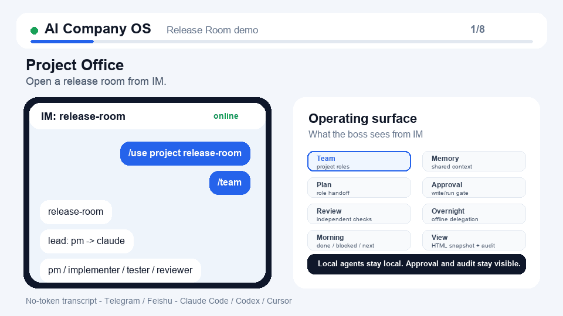

# 我做了一个“老板不在也能运转”的 AI 项目办公室



最近用 AI coding agent 最大的感受是:  
AI 很强,但我还是被电脑绑住了😢。

痛感很日常:中午去吃饭,agent 还在跑测试;路上群里问“今天能不能发”;睡前想把任务交出去,又怕第二天回来只看到一屏混杂输出。

Claude Code、Codex、Cursor、Gemini 都能干活,但真正麻烦的是:

- 长任务做完后接不住
- 手机上看不到局面,只能看碎片
- 多个 agent 各说各话,不像团队
- 项目经验每次都要重讲
- 离开 Mac 后就不好继续管理
- 写文件/跑命令不能默认放飞

现实公司不是这样的。老板不在办公室,公司也会继续运转:CEO 拆目标,负责人盯进度,关键风险再升级。

所以我做了 AI Company OS。它不是新的聊天 UI,而是把你本机 AI CLI 组织成一个能通过 Telegram 远程管理的小团队。

你可以给项目任命 PM、implementer、tester、reviewer,然后在手机上:

```text
/ask
/approve
/overnight
/morning
/task
/audit
```

睡前把任务交出去,风险动作等你审批;第二天先看早报和局面,需要细节再查任务和审计。

它不承诺 AI 永远正确,所以才把审批、审计、打断、早报放在第一层。

我觉得这才是 agent 真正进入日常工作的样子:不是多一个聊天框,而是你不在电脑前时,项目也能被组织起来继续往前走。

项目: AI Company OS  
关键词: 本机 agents / Telegram / 审批 / 审计 / 离线托管

#AI工具 #程序员 #开源项目 #AI编程 #效率工具
