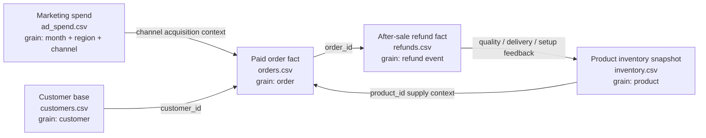
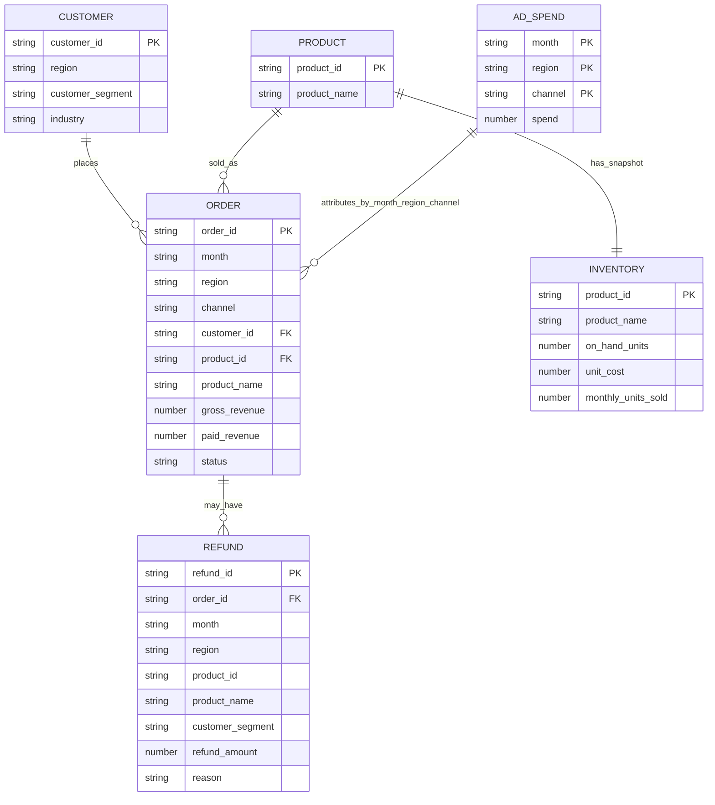

# Enterprise Week One Data Model

This folder contains a small synthetic enterprise dataset for the Data-Agent V1
benchmark. It is designed to make the data-agent answer revenue, channel,
refund, inventory, customer-segment, and regional questions with deterministic
evidence.

The data is not real customer data. It is intentionally small so humans can
inspect the numbers and verify whether the data-agent is reasoning from the
tables instead of guessing.

## Business Process View



The process modeled here is:

1. The business spends by **month + region + channel**.
2. Customers place paid orders for products through channels.
3. Refund events happen after orders and are tied back to product and customer
   segment.
4. Inventory gives supply-side context for product risk and stock cover.

## Entity Relationship View



`PRODUCT` is a conceptual entity inferred from `orders.csv` and
`inventory.csv`. There is no standalone product master table in this fixture.

## Table Grain And Join Keys

| File | Grain | Primary key | Join keys | Purpose |
|---|---|---|---|---|
| `orders.csv` | One paid order | `order_id` | `customer_id`, `product_id`, `month`, `region`, `channel` | Revenue, channel mix, product mix, customer-segment revenue |
| `refunds.csv` | One refund event | `refund_id` | `order_id`, `product_id`, `month`, `region` | Refund amount, refund rate, product and segment refund contributors |
| `ad_spend.csv` | Month + region + channel | `month + region + channel` | `month`, `region`, `channel` | ROAS and channel efficiency |
| `inventory.csv` | One product snapshot | `product_id` | `product_id` | Inventory months of cover and stock risk |
| `customers.csv` | One customer | `customer_id` | `customer_id` | Customer segment, region, industry metadata |

## Metric Definitions

| Metric | Formula | Source tables | Current benchmark default |
|---|---|---|---|
| Paid revenue | `sum(orders.paid_revenue)` where `status = paid` | `orders.csv` | Default revenue metric |
| Revenue drop | `(previous_month_paid_revenue - current_month_paid_revenue) / previous_month_paid_revenue` | `orders.csv` | Month-over-month |
| ROAS | `paid revenue attributed to channel / ad spend` | `orders.csv`, `ad_spend.csv` | Same month, region, channel |
| Refund rate | `sum(refund_amount) / sum(paid_revenue)` | `refunds.csv`, `orders.csv` | Paid revenue denominator |
| Inventory months of cover | `on_hand_units / monthly_units_sold` | `inventory.csv` | Product-level snapshot |

## Canonical Seed Question

The first benchmark question is:

```text
本月华东区收入为什么下降？
```

The answer is computed from `orders.csv`:

| Month | Region | Paid revenue |
|---|---|---:|
| 2026-05 | East | 120000 |
| 2026-06 | East | 84000 |

Calculation:

```text
drop_amount = 120000 - 84000 = 36000
drop_pct = 36000 / 120000 = 30.0%
```

The largest channel drag is also computed from `orders.csv`:

| Channel | 2026-05 East | 2026-06 East | Delta |
|---|---:|---:|---:|
| Douyin | 45000 | 28000 | -17000 |
| Kuaishou | 30000 | 21000 | -9000 |
| Search | 25000 | 20000 | -5000 |
| Referral | 20000 | 15000 | -5000 |

So the deterministic answer is:

```text
East paid revenue dropped from 120000 to 84000, down 36000 or 30.0%.
The largest channel drag is Douyin, down 17000.
```

## What This Fixture Can Test

- Whether the data-agent can map business language to metric + dimensions.
- Whether it can show exact evidence and formulas.
- Whether it asks for missing metric/time/scope instead of guessing.
- Whether AICO can orchestrate agents to improve a concrete data product.

## What This Fixture Cannot Prove

- It does not prove production-scale SQL generation.
- It does not prove real customer data integration.
- It does not cover permissions, row-level security, or PII workflows.
- It does not prove causal attribution; it only computes deterministic
  descriptive evidence.
